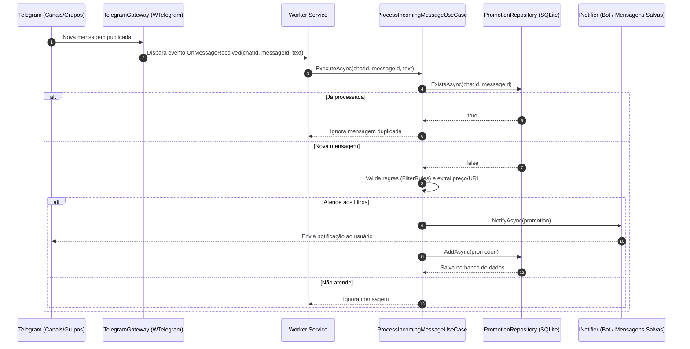

# PromoBot 🤖📦

> **Monitor inteligente de promoções e ofertas em canais do Telegram em tempo real com processamento automatizado, filtragem por palavras-chave/preço e notificações instantâneas.**

[](https://dotnet.microsoft.com/)
[](https://docs.microsoft.com/dotnet/csharp/)
[](https://www.sqlite.org/)
[](https://learn.microsoft.com/ef/core/)
[](https://github.com/wiz0u/WTelegramClient)

---

## 📌 Sobre o Projeto

O **PromoBot** é um serviço em segundo plano (*Worker Service*) desenvolvido em **.NET 10** para automatizar o monitoramento de canais e grupos de promoções no Telegram. 

Diferente de bots tradicionais que dependem de privilégios de administrador em grupos de terceiros, o PromoBot utiliza o protocolo **MTProto** (como cliente de usuário via [WTelegramClient](https://github.com/wiz0u/WTelegramClient)), permitindo interceptar mensagens de qualquer canal ou grupo público/privado em que a conta do usuário esteja presente.

O serviço analisa as mensagens recebidas, extrai informações cruciais (links de ofertas e preços em reais), valida contra critérios de busca personalizados e envia alertas instantâneos para o usuário, além de persistir o histórico para evitar notificações duplicadas.

---

## ✨ Funcionalidades Principais

- ⚡ **Escuta em Tempo Real (MTProto):** Conexão direta com a API do Telegram, recebendo eventos de novas mensagens de múltiplos canais configurados simultaneamente.
- 🎯 **Filtragem Inteligente por Regras:**
  - Busca por termos/palavras-chave (*case-insensitive*).
  - Teto de preço opcional (*MaxPrice*): filtre apenas ofertas abaixo do valor desejado.
  - Avaliação *Lazy* de preço para evitar processamento desnecessário de expressões regulares em mensagens não correspondentes.
- 🔍 **Parsers Especializados:**
  - **`PriceExtractor`:** Identifica valores no padrão monetário brasileiro (`R$ 1.299,00`, `R$99`, `R$ 45,50`), utilizando expressões regulares compiladas via Source Generators (`[GeneratedRegex]`).
  - **`UrlExtractor`:** Extrai e higieniza links de compra (`http`/`https`), removendo pontuações residuais de fim de frase.
- 🛡️ **Deduplicação & Persistência:**
  - Armazenamento em banco de dados **SQLite** via **Entity Framework Core**.
  - Índice único em `(IdMessage, ChatId)` garantindo que a mesma oferta nunca seja alertada ou salva duas vezes.
- 🔔 **Notificadores Desacoplados (`INotifier`):**
  - **`TelegramBotNotifier`:** Dispara a oferta via HTTP através da API oficial de Bots do Telegram (`sendMessage`) para um chat ou canal específico.
  - **`SavedMessagesNotifier`:** Envia a oferta diretamente para a conversa de **"Mensagens Salvas"** (*Saved Messages*) do próprio perfil Telegram via MTProto.

---

## 🏛️ Arquitetura e Estrutura

O projeto segue princípios de **Clean Architecture** (Arquitetura Limpa), promovendo baixo acoplamento, alta coesão e facilidade de testes:

```
PromoBot/
├── Directory.Build.props              # Configurações globais de compilação (.NET 10, C# nullable/implicit usings)
├── Directory.Packages.props           # Gerenciamento centralizado de dependências (Central Package Management - CPM)
├── PromoBot.slnx                      # Solução .NET
└── src/
    ├── PromoBot.Domain/               # Camada de Domínio
    │   └── Entities/
    │       ├── Promotion.cs           # Entidade de promoção (dados da mensagem, preço, url, status)
    │       └── FilterRule.cs          # Regra de negócio e validação de filtros e limites de preço
    │
    ├── PromoBot.Application/          # Camada de Aplicação
    │   ├── Interfaces/
    │   │   ├── INotifier.cs           # Contrato para envio de alertas
    │   │   ├── IPromotionRepository.cs# Contrato de persistência de promoções
    │   │   └── ITelegramGateway.cs    # Contrato do gateway MTProto
    │   ├── Parsers/
    │   │   ├── PriceExtractor.cs      # Regex e conversão de moeda pt-BR
    │   │   └── UrlExtractor.cs        # Extração e validação de URLs
    │   └── UseCases/
    │       └── ProcessIncomingMessageUseCase.cs # Orquestrador do fluxo da mensagem
    │
    ├── PromoBot.Infrastructure/       # Camada de Infraestrutura
    │   ├── Configurations/            # Mapeamento do EF Core (Fluent API)
    │   ├── Migrations/                # Migrações do banco de dados SQLite
    │   ├── Persistence/
    │   │   ├── PromoBotDataContext.cs # DbContext da aplicação
    │   │   └── PromotionRepository.cs # Implementação do repositório SQLite
    │   └── Telegram/
    │       ├── TelegramGateway.cs     # Conexão WTelegramClient e despacho de eventos
    │       ├── TelegramSettings.cs    # Configurações do cliente MTProto
    │       ├── TelegramBotNotifier.cs # Notificador via Telegram Bot API
    │       └── SavedMessagesNotifier.cs # Notificador para "Mensagens Salvas"
    │
    └── PromoBot.Worker/               # Host / Ponto de Entrada
        ├── Program.cs                 # Configuração do Host, DI e logging
        ├── Worker.cs                  # BackgroundService gerenciador do ciclo de vida
        ├── appsettings.json           # Configurações gerais da aplicação
        └── appsettings.Development.json
```

### Fluxo de Processamento



---

## 🚀 Como Executar

### Pré-requisitos

1. **[.NET 10 SDK](https://dotnet.microsoft.com/download/dotnet/10.0)** instalado.
2. Conta ativa no Telegram.
3. Credenciais da API MTProto do Telegram:
   - Obtenha `ApiId` e `ApiHash` em [my.telegram.org](https://my.telegram.org) (na seção *API development tools*).
4. *(Opcional)* Token de Bot criado pelo [@BotFather](https://t.me/BotFather) caso utilize o `TelegramBotNotifier`.

---

### Passo 1: Clonar o Repositório

```bash
git clone https://github.com/ViniciusMoraisAraujo/PromoBot.git
cd PromoBot
```

---

### Passo 2: Configuração (`appsettings.json`)

Crie ou edite o arquivo `src/PromoBot.Worker/appsettings.json` (ou utilize *User Secrets* em desenvolvimento):

```json
{
  "Logging": {
    "LogLevel": {
      "Default": "Information",
      "Microsoft.Hosting.Lifetime": "Information"
    }
  },
  "ConnectionStrings": {
    "DefaultConnection": "Data Source=promobot.db"
  },
  "Telegram": {
    "ApiId": 12345678,
    "ApiHash": "seu_api_hash_aqui",
    "PhoneNumber": "+5511999999999",
    "TargetChatIds": [
      1234567890,
      9876543210
    ]
  },
  "FilterRules": [
    {
      "KeyWord": "monitor",
      "MaxPrice": 1200.00
    },
    {
      "KeyWord": "playstation 5",
      "MaxPrice": 3500.00
    },
    {
      "KeyWord": "cupom",
      "MaxPrice": null
    }
  ],
  "TelegramBot": {
    "BotToken": "1234567890:ABCdefGHIjklMNOpqrsTUVwxyz",
    "ChatId": "1402020220"
  }
}
```

> [!TIP]
> **Como obter os `TargetChatIds`:**
> O `TelegramGateway` normaliza automaticamente IDs de canais/supergrupos do Telegram (incluindo o prefixo `-100`). Ao receber mensagens de canais nos quais você participa, o log registrará o ID do chat.

---

### Passo 3: Executar as Migrações do Banco de Dados

Certifique-se de aplicar as migrações do Entity Framework Core para criar a base SQLite:

```bash
dotnet ef database update --project src/PromoBot.Infrastructure --startup-project src/PromoBot.Worker
```

---

### Passo 4: Executar a Aplicação

Inicie o Worker:

```bash
dotnet run --project src/PromoBot.Worker
```

> [!IMPORTANT]
> **Primeiro Login:**
> Na primeira inicialização, a biblioteca `WTelegramClient` solicitará no console o **código de confirmação** enviado pelo Telegram (via app/SMS) e a **senha de 2 fatores (2FA)**, caso configurada.
> Após autenticar, será gerado um arquivo de sessão local (ex: `WTelegram.session`), eliminando a necessidade de login nas próximas inicializações.

---

## ⚙️ Escolha do Notificador

No arquivo [Program.cs](file:///home/vinicius-araujo/dev/PromoBot/src/PromoBot.Worker/Program.cs#L20-L22), você pode escolher qual mecanismo de notificação utilizar injetando a implementação de `INotifier`:

### 1. Via Bot do Telegram (`TelegramBotNotifier`)
Envia as notificações para um chat ou canal através do seu próprio bot oficial:
```csharp
builder.Services.AddScoped<INotifier, TelegramBotNotifier>();
```
*Requer `TelegramBot:BotToken` e `TelegramBot:ChatId` configurados.*

### 2. Direto nas Mensagens Salvas (`SavedMessagesNotifier`)
Envia as mensagens diretamente para as suas **Mensagens Salvas** no Telegram usando a própria conta conectada no MTProto:
```csharp
builder.Services.AddScoped<INotifier, SavedMessagesNotifier>();
```
*Não requer bot adicional.*

---

## 🛠️ Tecnologias Utilizadas

- **Runtime & Linguagem:** [.NET 10](https://dotnet.microsoft.com/) & C# 13
- **Telegram Client:** [WTelegramClient](https://github.com/wiz0u/WTelegramClient) (cliente MTProto completo para .NET)
- **Banco de Dados:** [SQLite](https://sqlite.org/)
- **ORM:** [Entity Framework Core 10](https://learn.microsoft.com/ef/core/) (Code-First + Migrations)
- **Injeção de Dependência & Logging:** `Microsoft.Extensions.Hosting`, `Microsoft.Extensions.Logging`
- **Configuração:** `Microsoft.Extensions.Options`, Central Package Management (`Directory.Packages.props`)

---

## 🔒 Segurança

- O arquivo `appsettings.json` e a base `promobot.db` estão incluídos no `.gitignore` para evitar o vazamento de tokens, senhas e números de telefone.
- Em ambientes de produção ou desenvolvimento compartilhado, utilize o **.NET User Secrets** ou variáveis de ambiente para armazenar suas credenciais com segurança:
  ```bash
  dotnet user-secrets set "Telegram:ApiHash" "seu_hash" --project src/PromoBot.Worker
  ```

---

## 📄 Licença

Este projeto é desenvolvido para fins educacionais e de uso pessoal. Sinta-se à vontade para contribuir através de Pull Requests ou abrir Issues com sugestões de melhorias!
